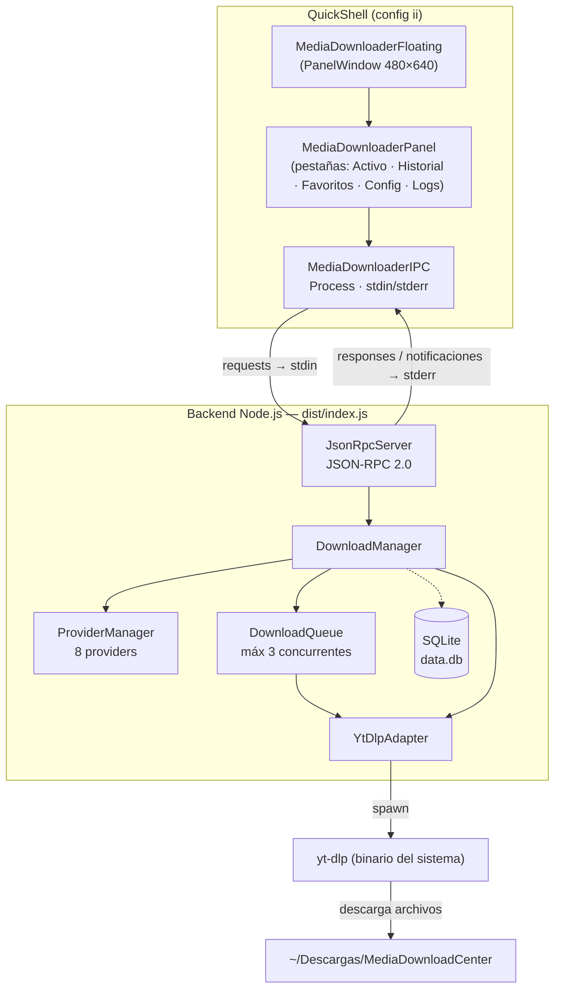
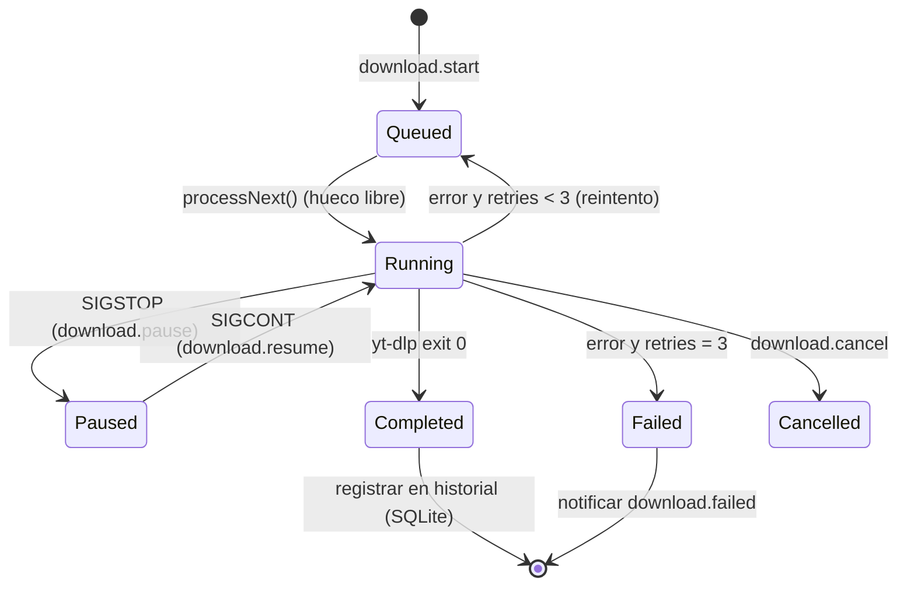
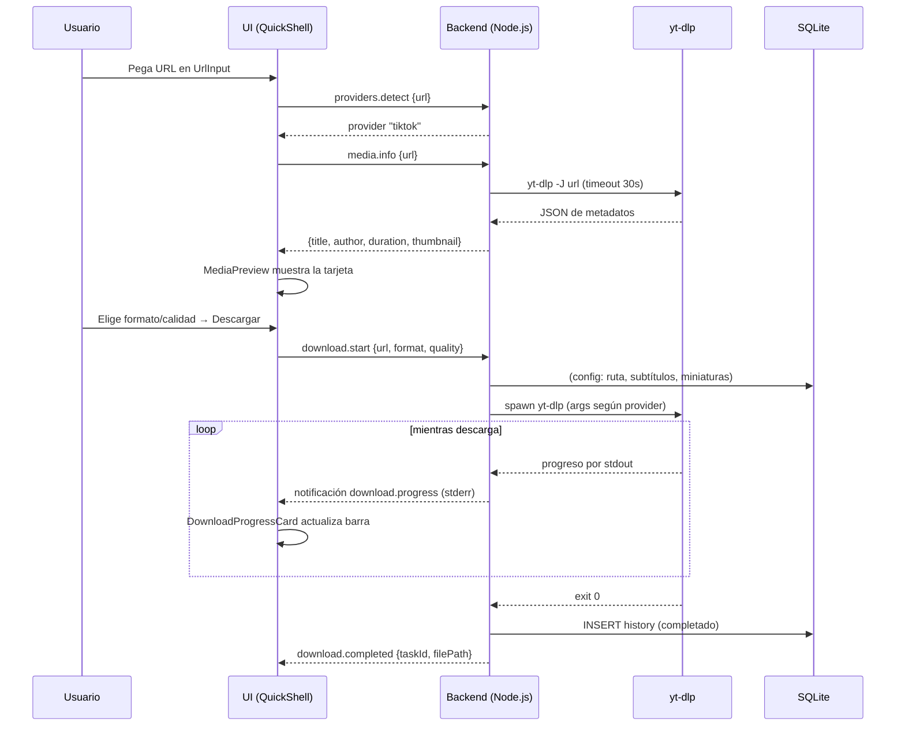
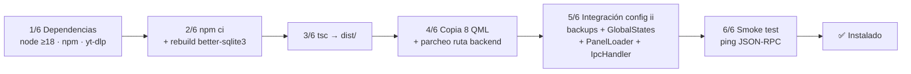

# 🗺️ Mapa de Funcionamiento — Media Download Center

> Mapa técnico completo de cómo funciona la app, cómo se instala y cómo quedó
> verificada en una sesión real de **Hyprland + QuickShell (Illogical-Impulse, config `ii`)**.
> Última verificación en vivo: 2026-09-30.

---

## 1. Vista general

```
┌──────────────────────────── Hyprland (Wayland) ────────────────────────────┐
│                                                                             │
│  QuickShell (qs -c ii)                                                       │
│  ┌───────────────────────────────────────────────────────────────────────┐  │
│  │ shell.qml ── IpcHandler "mediaDownloader" (toggle/show/hide)            │  │
│  │      │                                                                │  │
│  │ GlobalStates.mediaDownloaderFloatingOpen ──┐                           │  │
│  │                                            ▼                           │  │
│  │ IllogicalImpulseFamily ── PanelLoader ── MediaDownloaderFloating        │  │
│  │                                          └─ MediaDownloaderPanel       │  │
│  │                                              ├─ UrlInput              │  │
│  │                                              ├─ MediaPreview           │  │
│  │                                              ├─ FormatSelector        │  │
│  │                                              └─ DownloadProgressCard  │  │
│  │                                          MediaDownloaderIPC (Scope)   │  │
│  │                                              └─ Process ───────────┐  │  │
│  └─────────────────────────────────────────────────────────────────│──┘  │  │
│                                                                    │       │  │
│              requests JSON-RPC ── stdin (Process.write) ──────────►│       │  │
│              responses/notificaciones ◄── stderr (SplitParser) ───┘       │  │
└─────────────────────────────────────────────────────────────────────────────┘
                                                                     │
                                                                     ▼
┌───────────────────────────── Node.js (dist/index.js) ───────────────────────┐
│ JsonRpcServer (readline sobre stdin → stderr)                               │
│      │ 25 métodos RPC registrados                                            │
│      ▼                                                                       │
│ DownloadManager (fachada)                                                   │
│      ├─► ProviderManager ─► 8 providers (YouTube, Twitch, TikTok,           │
│      │                        Instagram, Twitter/X, Vimeo,                  │
│      │                        SoundCloud, Bandcamp)                        │
│      ├─► DownloadQueue ──► concurrencia máx. 3 · reintentos máx. 3           │
│      │        │                pausa SIGSTOP / reanuda SIGCONT              │
│      └─► YtDlpAdapter ──► spawn(yt-dlp) ─► info (-J) · descarga · progreso  │
│                                                                              │
│ SQLite (better-sqlite3) ── ~/.local/share/media-download-center/data.db     │
│      ├─ HistoryRepository (historial + favoritos)                           │
│      └─ ConfigRepository  (ruta descarga, formatos, calidad...)             │
└──────────────────────────────────────────────────────────────────────────────┘
```



**Principio clave del IPC**: las *requests* van de QML → backend por **stdin**
(`process.write()`), y las *responses* + *notificaciones* vuelven por **stderr**
(el stdout queda reservado para logs de yt-dlp). Por eso el backend escribe un
heartbeat `HEARTBEAT` a stderr cada 5 s y el QML ignora toda línea que no
empiece por `{`.

---

## 2. Protocolo JSON-RPC 2.0 — mapa completo

### 2.1 Requests (QML → backend, por stdin)

| Grupo | Método | Qué hace | Probado |
|-------|--------|----------|:-------:|
| Sistema | `ping` | Health check (versión yt-dlp, uptime) | ✅ |
| Providers | `providers.list` | Lista los 8 providers con capacidades | ✅ |
| Providers | `providers.detect` `{url}` | Detecta provider según patrones de URL | ✅ |
| Media | `media.info` `{url}` | Metadatos vía `yt-dlp -J` (título, autor, duración, miniatura) | ✅ |
| Media | `media.formats` `{url}` | Formatos disponibles |
| Media | `media.subtitles` `{url}` | Subtítulos disponibles |
| Descargas | `download.start` `{url, format, quality, extractAudio, ...}` | Valida URL → detecta provider → extrae info → encola | ✅ (UI) |
| Descargas | `download.pause` / `download.resume` `{taskId}` | SIGSTOP / SIGCONT del proceso yt-dlp |
| Descargas | `download.cancel` / `download.remove` `{taskId}` | Mata / elimina tarea de la cola |
| Descargas | `download.list` `{status?}` | Tareas con progreso y reintentos | ✅ (UI) |
| Descargas | `download.get` `{taskId}` | Detalle de una tarea |
| Historial | `history.list` / `history.favorites` `{limit, offset}` | Historial y favoritos (SQLite) | ✅ (UI) |
| Historial | `history.search` `{query}` | Búsqueda en historial |
| Historial | `history.toggleFavorite` / `history.delete` / `history.clear` | Mantenimiento del historial |
| Historial | `history.count` | Número de entradas | ✅ |
| Config | `config.get` `{key?}` | Config completa o una clave | ✅ |
| Config | `config.set` `{key, value}` | Persistir configuración |
| Config | `config.reset` | Volver a valores por defecto |
| Sistema | `system.status` | Cola activa, providers, historial, dataDir | ✅ |
| Sistema | `system.clearCompleted` | Limpiar completadas de la cola |

### 2.2 Responses y notificaciones (backend → QML, por stderr)

| Mensaje | Contenido | Consumo en QML |
|---------|------------|----------------|
| `server.ready` | `{version}` (al arrancar) | `backendReady = true` → señal `serverReady()` |
| response `{id, result/error}` | Respuesta a cada request | Resuelve la Promise de `pendingRequests[id]` |
| `download.progress` | `{taskId, progress: {percent, speed, eta, bytes}}` | Señal `downloadProgress` → barras de progreso |
| `download.status` | `{taskId, status, previous}` | Señal `downloadStatus` → refrescar lista |
| `download.completed` | `{taskId, title, filePath}` | Señal + registro en historial (SQLite) |
| `download.failed` | `{taskId, error}` | Señal `downloadFailed` → tarjeta en rojo |
| `queue.drained` | `{}` | Señal `queueDrained` |
| `server.shutdown` | `{}` (al cerrar stdin) | `backendReady = false` |

---

## 3. Ciclo de vida de una descarga



- **Concurrencia**: máx. 3 tareas `Running` simultáneas (config `maxConcurrentDownloads`).
- **Reintentos**: hasta 3 por tarea (`maxRetries`); al fallar se re-encola.
- **Progreso**: el adaptador parsea el stdout de yt-dlp (`--newline`) y emite
  `progress` → cola → notificación → QML.
- **Persistencia**: al completar se escribe en SQLite; la pestaña *Historial*
  lee con `history.list` / `history.favorites`.

---

## 4. Flujo end-to-end de una descarga



---

## 5. Mapa de archivos

### 5.1 Backend (`src/` → `dist/`)

| Archivo | Rol |
|---------|-----|
| `index.ts` | Punto de entrada: inicializa DB, services, providers, registra los 25 handlers RPC, heartbeats, shutdown graceful |
| `ipc/JsonRpcProtocol.ts` | Tipos y serialización JSON-RPC 2.0 |
| `ipc/JsonRpcServer.ts` | Lee stdin (readline), responde por **stderr**, notificaciones, `call()` remota |
| `core/DownloadManager.ts` | Fachada: valida URL, detecta provider, construye tareas, pausa/reanuda/cancela |
| `core/DownloadQueue.ts` | Mapa + orden de tareas, concurrencia máx. 3, reintentos, eventos de progreso |
| `core/ProviderManager.ts` | Registro y detección de providers por patrones de URL |
| `adapters/YtDlpAdapter.ts` | spawn de yt-dlp: `extractInfo` (-J, 30s), formatos, subtítulos, descarga con progreso |
| `providers/*Provider.ts` | 8 providers con formatos/calidades y capacidades por plataforma |
| `db/Database.ts` + repos | SQLite en `~/.local/share/media-download-center/data.db` |
| `services/*Service.ts` | Lógica de historial (favoritos, búsqueda) y config |
| `utils/UrlValidator.ts` | Validación de URL (protocolo seguro, etc.) |

### 5.2 Frontend QML (`qml/` → `~/.config/quickshell/ii/modules/ii/mediaDownloader/`)

| Archivo | Rol |
|---------|-----|
| `MediaDownloaderIPC.qml` | **Puente**: lanza el Process de Node, `sendRequest()` por stdin, parsea stderr, señales a la UI |
| `MediaDownloaderFloating.qml` | PanelWindow 480×640, namespace `quickshell:mediaDownloader`, visible según `GlobalStates.mediaDownloaderFloatingOpen` |
| `MediaDownloaderPanel.qml` | Panel completo: pestañas Activo/Historial/Favoritos/Config/Logs |
| `MediaDownloaderWidget.qml` | Variante compacta para integrar como pestaña inferior (opcional) |
| `UrlInput.qml` | Campo de URL con Ctrl+V del portapapeles y Escape |
| `MediaPreview.qml` | Tarjeta de previsualización (título, autor, duración, miniatura) |
| `FormatSelector.qml` | Selectores de formato/calidad/audio |
| `DownloadProgressCard.qml` | Tarjeta de progreso con barra, velocidad, ETA, pausa/cancelar |

### 5.3 Rutas en runtime

| Ruta | Qué es |
|------|--------|
| `~/.local/share/media-download-center/data.db` | Base de datos (historial, favoritos, config) |
| `~/Descargas/MediaDownloadCenter` | Carpeta de descargas por defecto (configurable) |
| `~/.config/quickshell/ii/modules/ii/mediaDownloader/` | Módulos QML instalados |
| `<repo>/dist/index.js` | Backend compilado (lanzado por el QML) |

---

## 6. Pipeline de instalación (`install.sh`)



| Paso | Detalle | Estado en la prueba |
|------|---------|----------------------|
| 1/6 | Verifica `node` (≥18), `npm`, `yt-dlp` en PATH | ✅ node v22.23.3 · npm 12.1.0 · yt-dlp 2026.08.19 |
| 2/6 | `npm ci` + **rebuild de better-sqlite3** (npm ≥11 omite build scripts nativos en modo no interactivo) + verificación del `.node` | ✅ (requirió el fallback `npm run install`) |
| 3/6 | `tsc` → `dist/index.js` | ✅ |
| 4/6 | Copia los 8 `.qml` y **sustituye `__BACKEND_DIR__`** por la ruta absoluta real del repo en la línea `command:` | ✅ → `["/usr/bin/node", ".../dist/index.js"]` |
| 5/6 | Backup único (`*.mdc-backup`) y ediciones **idempotentes** en: `GlobalStates.qml` (propiedad de visibilidad), `IllogicalImpulseFamily.qml` (import + `PanelLoader`), `shell.qml` (`IpcHandler target "mediaDownloader"`) | ✅ re-ejecución detecta "ya contiene…" sin duplicar |
| 6/6 | Lanza el backend, manda `ping` por stdin y valida `{"status":"ok"}` en stderr | ✅ `ytDlpVersion 2026.08.19` |

Flags: `--no-integrate` (no tocar la config ii) · `--uninstall` (restaura backups y borra el módulo).

---

## 7. Integración con Hyprland / QuickShell (ii)

Qué toca el instalador en `~/.config/quickshell/ii/`:

1. **`GlobalStates.qml`** → `property bool mediaDownloaderFloatingOpen: false`
2. **`panelFamilies/IllogicalImpulseFamily.qml`** →
   `import qs.modules.ii.mediaDownloader` +
   `PanelLoader { component: MediaDownloaderFloating {} }`
3. **`shell.qml`** → `IpcHandler` con target `mediaDownloader` (funciones
   `toggle`, `show`, `hide`)
4. **`modules/ii/sidebarRight/BottomWidgetGroup.qml`** → 4ª pestaña
   «Descargas» que carga `MediaDownloaderWidget.qml` (widget compacto con
   campo URL → preview → formatos → botón Descargar → mini cola)
5. **`~/.config/illogical-impulse/translations/es_MX.json`** → traducciones
   ES de los textos de la app (solo si el archivo no existe)

### Cómo abrir el panel

```bash
qs -c ii ipc call mediaDownloader toggle     # abre/cierra
qs -c ii ipc call mediaDownloader show       # solo abrir
qs -c ii ipc call mediaDownloader hide       # solo cerrar
```

Atajo de teclado en `hyprland.conf`:

```ini
bind = SUPER, D, exec, qs -c ii ipc call mediaDownloader toggle
```

### Recargar tras cambios

```bash
pkill -x qs && qs -c ii &          # reinicio completo
# o simplemente: qs -c ii ipc call panelFamily cycle
```

> ⚠️ **NUNCA reinicies QuickShell con la pantalla bloqueada**: la pantalla de
> bloqueo vive dentro de QuickShell y moriría con él (Hyprland mostraría
> *"lockscreen app died"*). Recuperación sin perder la sesión: lanzar
> `hyprlock` (crea un nuevo cliente de bloqueo) y escribir tu contraseña.

### Los botones de descarga

Dentro de la pestaña «Descargas» (o del panel flotante), los controles
**aparecen después de analizar un enlace**: pega la URL → Enter → el widget
consulta `media.info` → aparecen la vista previa, el selector de formato y el
botón **Descargar**. Con el campo vacío solo se ve el input con el texto
*"Pega un enlace para descargar..."*.

---

## 8. Resultados de la verificación en vivo (2026-09-30)

| # | Prueba | Resultado |
|---|--------|-----------|
| 1 | Compilación TypeScript | ✅ `dist/index.js` |
| 2 | Backend standalone: ping / providers.list (8) / providers.detect (YouTube) / config.get / system.status / history | ✅ todo responde por stdin→stderr |
| 3 | `install.sh` completo 6/6 | ✅ |
| 4 | Idempotencia (2ª ejecución no duplica ediciones) | ✅ |
| 5 | Ruta del backend parcheada en el QML instalado | ✅ `/usr/bin/node …/Proyectos/DownLoadsManagerEnd4/dist/index.js` |
| 6 | QuickShell reiniciado y módulo cargado | ✅ log: `Backend process started` → `Backend ready (v1.0.0)` |
| 7 | Backend lanzado **por el widget** en sesión viva | ✅ PID visible: `node …/dist/index.js` |
| 8 | Ventana flotante como capa Hyprland | ✅ `quickshell:mediaDownloader` 480×640 en `hyprctl layers` |
| 9 | `media.info` end-to-end con URL real del historial (TikTok) | ✅ `{provider:"tiktok", title:"#challeng #fy", author:"dilanbeats", duration:13}` |
| 10 | Captura de la ventana en pantalla | ✅ ver `docs/captura-viva.png` |

### 8.1 Segunda ronda: ciclo completo uninstall → install → descarga real

Repetida desde cero para confirmar que el script implementa la app de verdad:

| # | Prueba | Resultado |
|---|--------|-----------|
| 1 | `--uninstall`: módulo borrado + config restaurada desde backups | ✅ 0 restos de `mediaDownloader` en la config ii |
| 2 | Tras reiniciar QuickShell sin el módulo | ✅ ningún proceso backend (confirmación de que el widget es quien lo lanza) |
| 3 | Instalación limpia 6/6 (fallback nativo better-sqlite3 se activó solo) | ✅ |
| 4 | QuickShell reiniciado: módulo carga y el widget lanza el backend | ✅ handshake `Backend ready (v1.0.0)` |
| 5 | **Reinicio completo de la máquina**: QuickShell arrancó con la sesión Hyprland y el módulo cargó el backend **automáticamente al boot**, sin intervención manual | ✅ implementación persistente de sesión |
| 6 | Descarga real E2E (URL del historial, ruta ya usada): ciclo `queued → running → completed` + registro en historial con timestamp del día | ✅ |
| 7 | Descarga real a carpeta virgen: **transferencia de 4,2 MB verificada** + miniatura automática (47 KB) | ✅ ver RPC en el log de la sesión |
| 8 | `qs -c ii ipc call mediaDownloader toggle` abre la capa en la sesión viva | ✅ captura en `docs/captura-panel-abierto.png` |

### Problemas detectados y corregidos durante la prueba

| Problema | Causa | Corrección |
|----------|-------|------------|
| ❌ El QML apuntaba a `~/Descargas/DownLoadsManagerEnd4` (inexistente) | Ruta absoluta hardcodeada de una ubicación anterior del repo | El QML fuente usa `__BACKEND_DIR__` y `install.sh` lo parchea con la ruta real (paso 4/6) |
| ❌ El módulo nunca cargaba | No estaba registrado en la config ii | Paso 5/6: import + `PanelLoader` + propiedad en `GlobalStates` |
| ❌ No había forma de abrir el panel | Sin propiedad de estado ni IPC | Propiedad en `GlobalStates` + `IpcHandler` (`qs ipc call mediaDownloader toggle`) |
| ❌ `better-sqlite3` sin binario nativo | npm ≥11 omite scripts de build nativos sin TTY | Paso 2/6: `npm rebuild` + fallback `npm run install` + verificación del `.node` |
| ❌ El instalador "éxito" aunque npm fallara | `\|\| true` tragaba errores | Paso 2/6 ahora valida el binario nativo y falla con mensaje claro |
| ❌ Un paréntesis sin cerrar en install.sh | Typo en `$(grep …)` | Corregido + `bash -n` como verificación |

### Limitaciones conocidas (de plataformas, no del código)

- **YouTube** puede quedarse colgado en `media.info` si la IP/entorno dispara
  protección anti-bot: es comportamiento de yt-dlp sin cookies. Solución usual:
  pasar `--cookies-from-browser` (requiere soporte en el adapter).
- **Vimeo** exige login desde 2025+ (`web client only works when logged-in`):
  el provider está limitado a credenciales/cookies.
- **Cierre de stdin**: el backend hace `process.exit(0)` al recibir EOF en stdin
  (comportamiento correcto para QuickShell, pipe persistente). Al probarlo desde
  terminal con `printf '...' | node dist/index.js`, los handlers lentos se
  cortan: mantener abierto el pipe, p. ej. `(printf '...'; sleep 12) \| node dist/index.js`.
- Miniaturas de algunas plataformas devuelven 403 desde el CDN (solo cosmético).

---

## 9. Desinstalación rápida

```bash
./install.sh --uninstall
# restaura GlobalStates.qml / IllogicalImpulseFamily.qml / shell.qml
# desde sus backups (*.mdc-backup) y borra el módulo QML.
```
